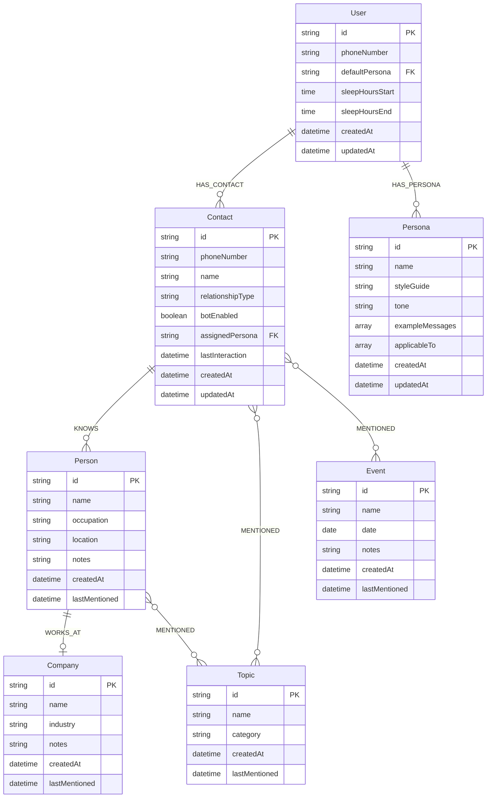

# Infrastructure Guidelines

This file provides guidance for Claude Code when working with SecondMe infrastructure.

## Directory Structure

```
infra/
├── redis/
│   └── redis.conf           # Redis configuration (256MB, LRU eviction)
├── falkordb/
│   └── init-schema.cypher   # Graph database schema & initial data
├── caddy/
│   └── Caddyfile            # Reverse proxy & HTTPS termination
└── monitoring/
    ├── README.md            # Monitoring setup guide
    └── alerting-rules.yml   # Prometheus alerting rules
```

## Service Ports

| Service | Container Port | Host Port (Docker) | Host Port (Local) |
|---------|---------------|-------------------|-------------------|
| Redis | 6379 | 6380 | 6380 |
| FalkorDB | 6379 | 6379 | 6379 |
| Gateway | 3001 | 3001 | 3001 |
| Orchestrator | 3002 | 3002 | 3002 |
| Graph Worker | 3003 | 3003 | 3003 |
| Frontend | 3000 | 3000 | 3000 |

## Redis Configuration

### Key Settings (`redis.conf`)
- **Memory**: 256MB max with LRU eviction
- **Persistence**: RDB snapshots (900s/1, 300s/10, 60s/10000)
- **AOF**: Disabled for performance
- **Keyspace Events**: `Ex` (expired key notifications)

### Data Structures
| Key Pattern | Type | Purpose |
|-------------|------|---------|
| `PAUSE:ALL` | String | Global kill switch |
| `PAUSE:{contactId}` | String | Contact-specific pause (TTL) |
| `COUNTER:{contactId}:msgs` | String | Rate limit counter (60s TTL) |
| `CACHE:persona:{id}` | String | Persona cache (30min TTL) |
| `QUEUE:messages` | Stream | Incoming message queue |
| `QUEUE:responses` | Stream | Outgoing response queue |
| `QUEUE:chat_history` | Stream | Chat history ingestion queue |

## FalkorDB Knowledge Graph

### Graph Model Overview



### Node Types (Full Properties)

#### User
The bot owner (single node per instance).
| Property | Type | Required | Description |
|----------|------|----------|-------------|
| `id` | string | Yes | Unique identifier (e.g., `user-1`) |
| `phoneNumber` | string | Yes | Owner's WhatsApp number |
| `defaultPersona` | string | Yes | Default persona ID for new contacts |
| `sleepHoursStart` | time | No | Bot sleep start (e.g., `23:00:00`) |
| `sleepHoursEnd` | time | No | Bot sleep end (e.g., `07:00:00`) |
| `createdAt` | datetime | Yes | Creation timestamp |
| `updatedAt` | datetime | Yes | Last update timestamp |

#### Contact
WhatsApp contacts the bot interacts with.
| Property | Type | Required | Description |
|----------|------|----------|-------------|
| `id` | string | Yes | Unique identifier (e.g., `contact_{hash}`) |
| `phoneNumber` | string | Yes | Contact's WhatsApp number |
| `name` | string | Yes | Display name |
| `relationshipType` | string | Yes | One of: `friend`, `family`, `colleague`, `client`, `acquaintance` |
| `botEnabled` | boolean | Yes | Whether bot responds to this contact |
| `assignedPersona` | string | No | Override persona ID (uses default if null) |
| `lastInteraction` | datetime | No | Last message timestamp |
| `createdAt` | datetime | Yes | Creation timestamp |
| `updatedAt` | datetime | Yes | Last update timestamp |

#### Persona
Response style configurations.
| Property | Type | Required | Description |
|----------|------|----------|-------------|
| `id` | string | Yes | Unique identifier (e.g., `persona-professional`) |
| `name` | string | Yes | Display name |
| `styleGuide` | string | Yes | Detailed instructions for response style |
| `tone` | string | Yes | One of: `formal`, `casual`, `friendly` |
| `exampleMessages` | array | Yes | 3-5 example responses in this style |
| `applicableTo` | array | Yes | Relationship types this persona suits |
| `createdAt` | datetime | Yes | Creation timestamp |
| `updatedAt` | datetime | Yes | Last update timestamp |

#### Person
People mentioned in conversations (extracted entities).
| Property | Type | Required | Description |
|----------|------|----------|-------------|
| `id` | string | Yes | Unique identifier (e.g., `person_{hash}`) |
| `name` | string | Yes | Person's name |
| `occupation` | string | No | Job title or role |
| `location` | string | No | City, country, or region |
| `notes` | string | No | Additional context from conversations |
| `createdAt` | datetime | Yes | First mention timestamp |
| `lastMentioned` | datetime | Yes | Most recent mention |

#### Company
Organizations mentioned in conversations.
| Property | Type | Required | Description |
|----------|------|----------|-------------|
| `id` | string | Yes | Unique identifier (e.g., `company_{hash}`) |
| `name` | string | Yes | Company name |
| `industry` | string | No | Industry category |
| `notes` | string | No | Additional context |
| `createdAt` | datetime | Yes | First mention timestamp |
| `lastMentioned` | datetime | Yes | Most recent mention |

#### Topic
Discussion subjects extracted from conversations.
| Property | Type | Required | Description |
|----------|------|----------|-------------|
| `id` | string | Yes | Unique identifier (e.g., `topic_{hash}`) |
| `name` | string | Yes | Topic name |
| `category` | string | Yes | One of: `Technology`, `Lifestyle`, `Work`, `Entertainment`, `Health`, `Finance`, `Other` |
| `createdAt` | datetime | Yes | First mention timestamp |
| `lastMentioned` | datetime | Yes | Most recent mention |

#### Event
Dates and events referenced in conversations.
| Property | Type | Required | Description |
|----------|------|----------|-------------|
| `id` | string | Yes | Unique identifier (e.g., `event_{hash}`) |
| `name` | string | Yes | Event name |
| `date` | date | No | Event date if known |
| `notes` | string | No | Additional context |
| `createdAt` | datetime | Yes | First mention timestamp |
| `lastMentioned` | datetime | Yes | Most recent mention |

### Relationships

| Type | From | To | Properties | Description |
|------|------|----|-----------|-------------|
| `HAS_CONTACT` | User | Contact | - | User owns this contact |
| `HAS_PERSONA` | User | Persona | - | User has this persona available |
| `KNOWS` | Contact | Person | - | Contact knows this person |
| `WORKS_AT` | Person | Company | - | Person works at company |
| `MENTIONED` | Contact | Topic/Person/Event | `times`, `lastMentioned` | Entity mentioned in conversation |

### Indexes & Constraints

```cypher
-- Uniqueness constraints (auto-create index)
CREATE CONSTRAINT ON (u:User) ASSERT u.id IS UNIQUE;
CREATE CONSTRAINT ON (c:Contact) ASSERT c.id IS UNIQUE;
CREATE CONSTRAINT ON (p:Persona) ASSERT p.id IS UNIQUE;
CREATE CONSTRAINT ON (per:Person) ASSERT per.id IS UNIQUE;
CREATE CONSTRAINT ON (comp:Company) ASSERT comp.id IS UNIQUE;
CREATE CONSTRAINT ON (t:Topic) ASSERT t.id IS UNIQUE;
CREATE CONSTRAINT ON (e:Event) ASSERT e.id IS UNIQUE;

-- Lookup indexes
CREATE INDEX ON :Contact(phoneNumber);
CREATE INDEX ON :Person(name);
CREATE INDEX ON :Company(name);
CREATE INDEX ON :Topic(category);
CREATE INDEX ON :Event(date);
```

### Query Patterns

#### Context Retrieval (Orchestrator)
```cypher
-- Get full contact context for response generation
MATCH (c:Contact {id: $contactId})
OPTIONAL MATCH (c)-[:KNOWS]->(p:Person)-[:WORKS_AT]->(comp:Company)
OPTIONAL MATCH (c)-[m:MENTIONED]->(t:Topic)
RETURN c.name, c.relationshipType,
       collect(DISTINCT {person: p.name, occupation: p.occupation, company: comp.name}) AS people,
       collect(DISTINCT {topic: t.name, category: t.category, times: m.times}) AS topics
```

#### Persona Selection
```cypher
-- Get appropriate persona for contact's relationship type
MATCH (u:User {id: $userId})-[:HAS_PERSONA]->(p:Persona)
WHERE $relationshipType IN p.applicableTo
RETURN p.id, p.styleGuide, p.tone, p.exampleMessages
LIMIT 1
```

#### Entity Extraction (Graph Worker)
```cypher
-- Merge new person entity (upsert)
MERGE (p:Person {name: $name})
ON CREATE SET p.id = $id, p.createdAt = datetime(), p.lastMentioned = datetime()
ON MATCH SET p.lastMentioned = datetime()
SET p.occupation = COALESCE($occupation, p.occupation),
    p.location = COALESCE($location, p.location)
RETURN p

-- Link person to contact
MATCH (c:Contact {id: $contactId})
MATCH (p:Person {id: $personId})
MERGE (c)-[:KNOWS]->(p)
```

#### Topic Tracking
```cypher
-- Increment topic mention count
MATCH (c:Contact {id: $contactId})
MERGE (t:Topic {name: $topicName})
ON CREATE SET t.id = $topicId, t.category = $category, t.createdAt = datetime()
MERGE (c)-[m:MENTIONED]->(t)
ON CREATE SET m.times = 1, m.lastMentioned = datetime()
ON MATCH SET m.times = m.times + 1, m.lastMentioned = datetime()
RETURN t, m.times
```

#### Recent Activity
```cypher
-- Get contacts with recent activity
MATCH (u:User {id: $userId})-[:HAS_CONTACT]->(c:Contact)
WHERE c.lastInteraction > datetime() - duration('P7D')
RETURN c.id, c.name, c.lastInteraction
ORDER BY c.lastInteraction DESC
LIMIT 10
```

### Entity Extraction Rules

The Graph Worker extracts entities using these patterns:

| Entity Type | Extraction Signals |
|-------------|-------------------|
| **Person** | Names following "my friend", "my colleague", proper nouns in social context |
| **Company** | "works at", "employed by", known company names, "the company" + name |
| **Topic** | Repeated nouns, subjects of discussion, hashtags, explicit topics |
| **Event** | Dates, "next week", "last month", event names, holidays |

### Default Personas

| ID | Name | Tone | Applicable To |
|----|------|------|---------------|
| `persona-professional` | Professional Colleague | formal | colleague, client, manager |
| `persona-casual` | Casual Friend | casual | friend, acquaintance |
| `persona-family` | Family Member | friendly | family |

## Caddy Reverse Proxy

### Production Features
- Automatic HTTPS via Let's Encrypt
- WebSocket support for Socket.io
- Security headers (HSTS, CSP, XSS protection)
- Internal-only binding for backend services

### Domain Configuration
Set `$DOMAIN` environment variable for production:
```bash
DOMAIN=yourdomain.com docker compose up -d
```

## Monitoring

### Health Endpoints
| Service | Endpoint |
|---------|----------|
| Gateway | `http://localhost:3001/health` |
| Orchestrator | `http://localhost:3002/health` |
| Graph Worker | `http://localhost:3003/health` |
| Frontend | `http://localhost:3000/api/health` |

### Alert Categories
| Category | Alerts |
|----------|--------|
| Service Health | ServiceDown, HighLatency |
| WhatsApp | Disconnected, SessionExpiring, HighMessageRate |
| AI | APIErrors, HighTokenUsage, LowCacheHitRate |
| Database | RedisDown, FalkorDBDown, HighMemory, SlowQueries |
| Security | RateLimitTriggers, KillSwitchEnabled |

### Metrics Available
- `whatsapp_connected` - Connection status gauge
- `messages_received_total` - Incoming message counter
- `tokens_used_total` - AI token consumption
- `cache_hit_rate` - Prompt cache effectiveness
- `active_pauses_total` - Paused contacts count

## Docker Commands

```bash
# Start all services
docker compose up -d

# View logs
docker compose logs -f [service]

# Restart specific service
docker compose restart orchestrator

# Check health
docker compose ps

# Stop all
docker compose down

# Stop and remove volumes (data loss!)
docker compose down -v
```

## Troubleshooting

### Redis Connection Failed
```
Error: getaddrinfo ENOTFOUND redis
```
**Cause**: Running service locally but using Docker hostname
**Fix**: Use `REDIS_HOST=localhost` and `REDIS_PORT=6380` for local dev

### FalkorDB Connection Failed
```
Error: NOAUTH Authentication required
```
**Cause**: Missing or incorrect password
**Fix**: Set `FALKORDB_PASSWORD` in `.env`

### Port Already in Use
```
Error: listen EADDRINUSE :::3001
```
**Fix**: Stop conflicting process or change port in `.env`

### WhatsApp Auth Lost
```
Error: Session expired
```
**Fix**: Delete `.wwebjs_auth` folder and re-scan QR code
